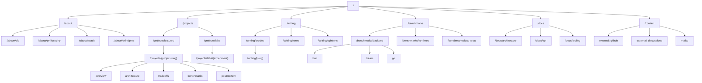

```mermaid
flowchart TD
Home["/"]

Home --> About["/about"]
Home --> Projects["/projects"]
Home --> Writing["/writing"]
Home --> Benchmarks["/benchmarks"]
Home --> Docs["/docs"]
Home --> Contact["/contact"]

%% ABOUT
About --> AboutBio["/about#bio"]
About --> AboutPhilosophy["/about#philosophy"]
About --> AboutStack["/about#stack"]
About --> AboutPrinciples["/about#principles"]

%% PROJECTS
Projects --> Featured["/projects/featured"]
Projects --> Labs["/projects/labs"]

Featured --> ProjectDetail["/projects/{project-slug}"]
ProjectDetail --> ProjectOverview["overview"]
ProjectDetail --> ProjectArchitecture["architecture"]
ProjectDetail --> ProjectTradeoffs["tradeoffs"]
ProjectDetail --> ProjectBenchmarks["benchmarks"]
ProjectDetail --> ProjectPostmortem["postmortem"]

Labs --> Experiments["/projects/labs/{experiment}"]

%% WRITING
Writing --> Articles["/writing/articles"]
Writing --> Notes["/writing/notes"]
Writing --> Opinions["/writing/opinions"]

Articles --> Article["/writing/{slug}"]

%% BENCHMARKS
Benchmarks --> BackendBench["/benchmarks/backend"]
Benchmarks --> RuntimeBench["/benchmarks/runtimes"]
Benchmarks --> LoadTests["/benchmarks/load-tests"]

BackendBench --> BunBench["bun"]
BackendBench --> BeamBench["beam"]
BackendBench --> GoBench["go"]

%% DOCS (Optional, but powerful)
Docs --> ArchitectureDocs["/docs/architecture"]
Docs --> API["/docs/api"]
Docs --> Tooling["/docs/tooling"]

%% CONTACT
Contact --> GitHub["external: github"]
Contact --> Discussions["external: discussions"]
Contact --> Email["mailto"]

```
